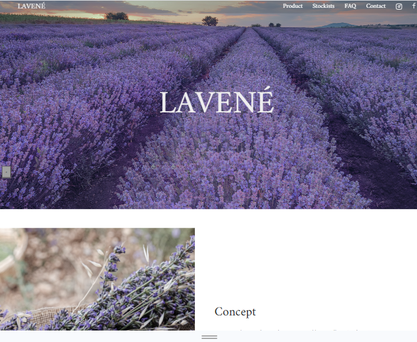
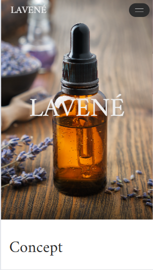
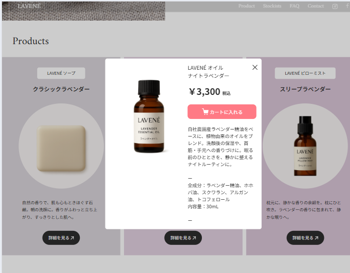

# LAVENE - Portfolio Site

## 概要
ポートフォリオ用に制作した架空ブランド「LAVENÉ」のWebサイトです。 ラベンダーをテーマに、シンプルで落ち着いた雰囲気のデザインを目指しました。
デザインからコーディングまで一貫して制作しました。

## 使用技術
- HTML / CSS / JavaScript (jQuery)
- レスポンシブ対応
- GitHub Pages で公開

## ポイント
- ナビゲーションの SP/PC 切り替えを実装
- メインビジュアルにスライダーを導入
- モーダル表示で商品詳細を確認可能
- フェードインアニメーションを適用

## デモ
[公開URLはこちら](https://github.com/takemura-cloud/lavene-portfolio.git)

## スクリーンショット
メインビジュアル  

スマホ表示  

モーダルウィンドウ  

## 制作期間
2025年9月（約3週間）

## 役割
個人制作（デザイン／コーディング）
- GitHub Pagesでの公開
